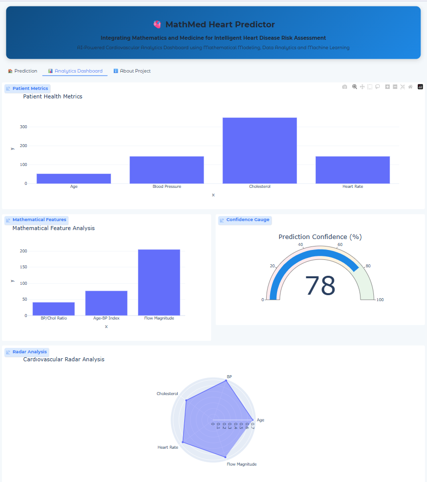
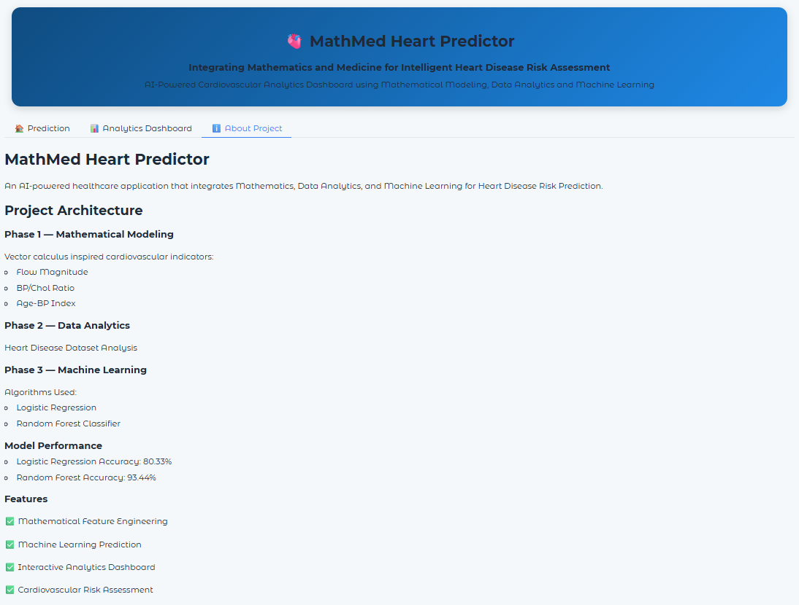

# 🫀 MathMed Heart Predictor

### Integrating Mathematics and Medicine for AI-Powered Heart Disease Risk Prediction

MathMed Heart Predictor is an end-to-end healthcare analytics application that combines **Mathematical Modeling, Data Analytics, Machine Learning, and Interactive Visualization** to predict heart disease risk.

The project demonstrates how mathematically engineered cardiovascular indicators can enhance traditional medical risk assessment and improve predictive performance using machine learning.

## Project Overview

Heart disease remains one of the leading causes of mortality worldwide. Traditional prediction systems rely heavily on clinical measurements, but mathematical modeling can provide additional insights into cardiovascular behavior.

This project integrates:

- Mathematical Feature Engineering
- Data Analytics
- Machine Learning
- Interactive Dashboard Visualization

Users can enter patient health parameters, generate mathematical cardiovascular indicators, and obtain real-time heart disease risk predictions through an intuitive analytics dashboard.

## 📷 Application Preview

### 🏠 Prediction Module

"C:\Users\Keerthi Priya\OneDrive\Pictures\Screenshots\screenshots\prediction-tab.png"

### 📊 Analytics Dashboard



### ℹ️ About Project



# 🏗️ Project Architecture

## Phase 1 — Mathematical Modeling

Mathematical features were engineered to represent cardiovascular characteristics:

### BP/Chol Ratio

Represents the relationship between blood pressure and cholesterol levels.

### Age-BP Index

A composite cardiovascular indicator derived from age and resting blood pressure.

### Flow Magnitude

Inspired by vector magnitude principles:

```math
Flow = \sqrt{BP^2 + HeartRate^2}
```

These engineered features were integrated into the machine learning pipeline to enhance predictive capability.

## Phase 2 — Data Analytics

Performed exploratory data analysis using the Heart Disease Dataset.

### Tasks Performed

- Data Cleaning
- Feature Engineering
- Correlation Analysis
- Statistical Analysis
- Visualization of Medical Variables

### Dataset Features

- Age
- Resting Blood Pressure
- Cholesterol
- Maximum Heart Rate
- Chest Pain Type
- Exercise Induced Angina
- Oldpeak
- Thalassemia
- Mathematical Features

## Phase 3 — Machine Learning

Multiple machine learning models were evaluated.

### Logistic Regression

Accuracy:

```text
80.33%
```

### Random Forest Classifier

Accuracy:

```text
93.44%
```

The Random Forest model achieved the highest predictive performance and was selected for deployment.

## Phase 4 — Deployment

The final application was deployed using:

- Gradio
- Hugging Face Spaces
- Plotly Interactive Visualizations

The deployed application provides:

- Real-Time Predictions
- Interactive Charts
- Mathematical Insights
- Risk Analysis Dashboard

# Features

## Prediction Module

- Heart Disease Risk Prediction
- Confidence Score Calculation
- Mathematical Feature Generation
- Real-Time Analysis

## Analytics Dashboard

### Patient Health Metrics

- Age
- Blood Pressure
- Cholesterol
- Heart Rate

### Mathematical Feature Analysis

- BP/Chol Ratio
- Age-BP Index
- Flow Magnitude

### Interactive Visualizations

- Patient Metrics Chart
- Mathematical Features Chart
- Confidence Gauge
- Cardiovascular Radar Chart

## About Section

- Project Architecture
- Technical Overview
- Model Performance
- Research Motivation

# Model Performance

| Model | Accuracy |
|---------|---------|
| Logistic Regression | 80.33% |
| Random Forest | **93.44%** |

# Technology Stack

## Programming Language

- Python

## Data Science & Machine Learning

- NumPy
- Pandas
- Scikit-Learn

## Visualization

- Plotly
- Matplotlib

## Web Application

- Gradio

## Deployment

- Hugging Face Spaces

# Project Structure

```text
MathMed-Heart-Predictor/
│
├── app.py
├── requirements.txt
├── heart_disease_rf_model.pkl
├── scaler.pkl
├── README.md
├── LICENSE
└── screenshots/
    ├── prediction-tab.png
    ├── analytics-dashboard.png
    └── about-project.png
```

# Installation

Clone the repository:

```bash
git clone https://github.com/YOUR_USERNAME/MathMed-Heart-Predictor.git
cd MathMed-Heart-Predictor
```

Install dependencies:

```bash
pip install -r requirements.txt
```

Run the application:

```bash
python app.py
```

# Key Contributions

- Integration of Mathematics and Medicine
- Novel Cardiovascular Feature Engineering
- Interactive Healthcare Analytics Dashboard
- High Accuracy Heart Disease Prediction
- End-to-End Deployment Pipeline

# Future Enhancements

- PDF Report Generation
- Prediction History Tracking
- Medical API Integration
- Additional Disease Prediction Modules
- Advanced Cardiovascular Analytics
- Explainable AI (XAI) Integration

# Author

**Keerthi Priya**

Computer Engineering (Data Science)

# License

This project is licensed under the MIT License.

---

⭐ If you found this project interesting, consider giving it a star on GitHub.
